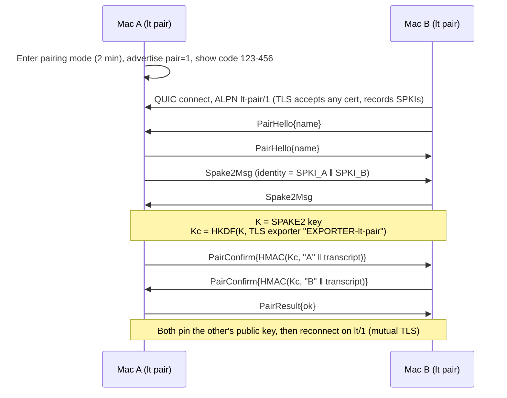
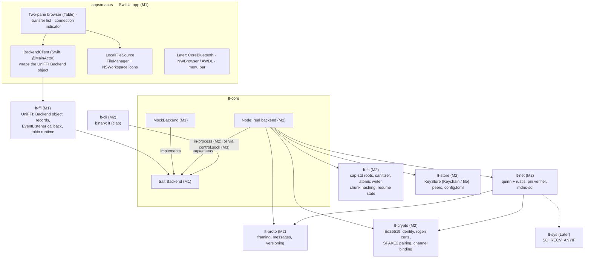
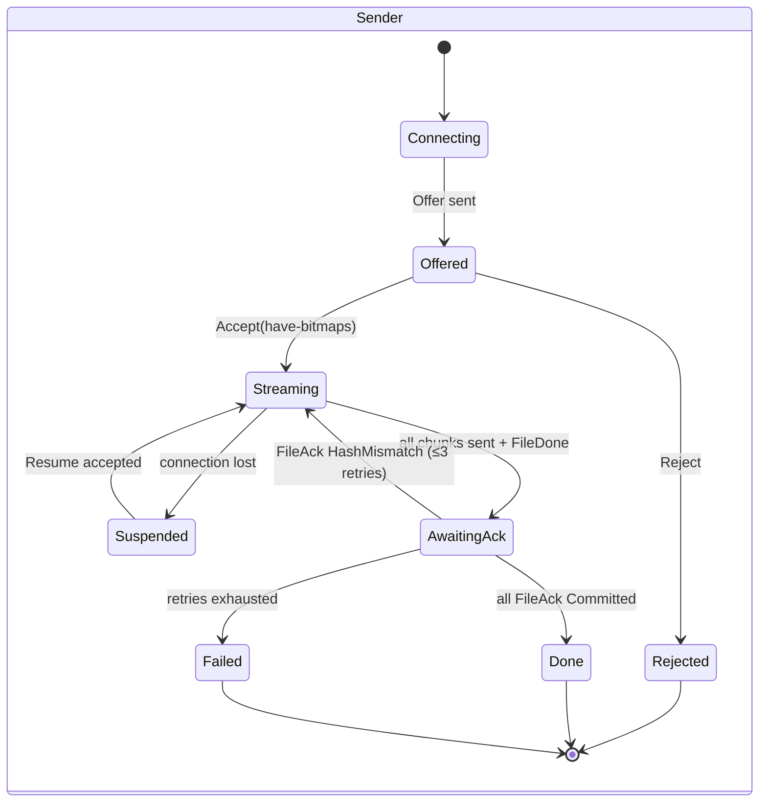
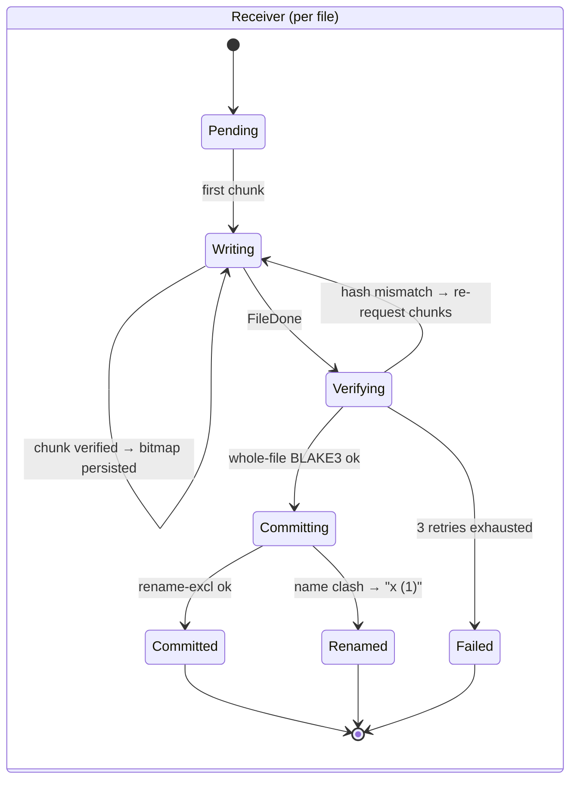

# LocalTransfer Roadmap

LocalTransfer moves files between two Macs (an M4 MacBook Pro and an M2 MacBook Air) in both directions, over the local network, with **no cloud and no accounts**. It has a Rust core, a native SwiftUI GUI (built first, against a mock peer) and a CLI called `lt`.

## Milestone status

| Milestone | Branch | Status |
|---|---|---|
| M0: Repo setup, roadmap | `docs/roadmap` | ✅ Done |
| M1: GUI with a mock peer | `M1` | 🚧 In progress: M1.1 ✅ M1.2 ✅ |
| M2: Real CLI transfer over the same Wi-Fi | `M2` | ⏳ Not started |
| M3: GUI + real networking combined | `M3` | ⏳ Not started |
| Later: BLE, AWDL, content-addressed skip, menu-bar agent, Share extension, drop folder, transport auto-switch | — | 💤 Shelved |

## Contents
1. [Research summary and chosen approach](#1-research-summary-and-chosen-approach)
2. [Transport and discovery](#2-transport-and-discovery)
3. [Security design](#3-security-design)
4. [Novelty features](#4-novelty-features)
5. [Architecture](#5-architecture)
6. [Wire protocol v1](#6-wire-protocol-v1)
7. [Interfaces](#7-interfaces)
8. [Milestones](#8-milestones)
9. [macOS realities](#9-macos-realities)
10. [Test strategy](#10-test-strategy)
11. [Risks and open questions](#11-risks-and-open-questions)
12. [Development workflow](#12-development-workflow)
13. [Sources](#13-sources)

---

## 1. Research summary and chosen approach

| Tool | Discovery | Transport | Security | Strengths / weaknesses |
|---|---|---|---|---|
| **AirDrop** | BLE adverts carrying truncated contact hashes, then AWDL + Bonjour | HTTPS over AWDL (Apple's peer-to-peer 802.11) | Apple ID-backed certs. Contact-hash leakage published by Stute et al. (USENIX Sec '19) | Best-in-class UX. Proprietary and account-bound. AWDL can't be reimplemented without driver-level work. |
| **OpenDrop / OWL** | Same as AirDrop, reverse-engineered | Needs OWL (userland AWDL on a monitor-mode NIC) | Mimics Apple certificate flows | Valuable research. Fragile, Linux-centric, not suitable as a base. |
| **NearDrop** | mDNS for Google Quick Share (Wi-Fi only; BLE not reverse-engineered) | TCP + protobuf (Nearby protocol) | UKEY2 handshake plus a short visual code | Proves a clean-room Swift implementation can work. Receive-only, LAN only. |
| **LocalSend** | UDP multicast `224.0.0.167:53317`, then HTTP `POST /register` | HTTPS REST | Self-signed cert, fingerprint = SHA-256(cert), **trust-on-first-use with no pairing code** | Simple and cross-platform. First contact is MITM-able, and HTTP request/response is clumsy for resume and multiplexing. |
| **croc** | None: rendezvous through a relay (public or self-hosted) | TCP via relay, multiplexed ports | PAKE from a code phrase, end-to-end encrypted | Great pairing UX. Depends on a relay, so it isn't truly local. |
| **magic-wormhole** | Mailbox server plus wordlist code | "Transit": direct TCP or relay, raced in parallel | SPAKE2, then NaCl secretbox | Gold standard for code-based pairing. Needs a server, and every transfer is a one-shot session with no persistent trust. |
| **Syncthing** | LAN broadcast/multicast every 30 s, plus global discovery | TCP/QUIC + TLS (Block Exchange Protocol) | Device ID = hash of cert, mutual TLS, explicit device approval | Excellent pinned-identity model and block hashing. It's continuous folder sync, not ad-hoc "send this file". |
| **KDE Connect** | UDP broadcast on `:1716`, plus mDNS | TCP, upgraded to TLS after a plaintext identity packet | Self-signed certs; the user compares fingerprints at pairing | Dual discovery is a good idea. The plaintext pre-TLS stage has produced real advisories (2020, 2025). |
| **rsync over SSH** | None (you type the host) | SSH | SSH host and user keys | Unbeatable delta transfer. Needs Remote Login enabled, no discovery, no GUI. |

### Decision: borrow ideas from several, design fresh in Rust

None of these is worth porting. AirDrop is closed. LocalSend's TOFU-over-HTTP design falls short of our security bar. Syncthing and rsync solve different problems. What we take from each:

- **Syncthing / KDE Connect:** a device identity that is the hash of a self-generated key, with mutual TLS and key pinning.
- **magic-wormhole / croc:** SPAKE2 short-code pairing, but fully local with no server.
- **LocalSend / KDE Connect:** zero-config LAN discovery. We use Bonjour, the macOS-native mechanism.
- **rsync / Syncthing:** block hashing, which gives us resume and content-addressed skipping.
- **AirDrop:** BLE for presence and AWDL for off-network transfers, done the supported way through Network.framework.

## 2. Transport and discovery

### Data transport: QUIC (`quinn` 0.11 + `rustls` 0.23, ring backend)

Why QUIC rather than TCP+TLS:
- **Multiplexed streams.** One control stream plus N parallel chunk streams, with no head-of-line blocking between files.
- **TLS 1.3 is mandatory** and built into the handshake. There's no plaintext stage, which avoids KDE Connect's class of bugs.
- **Connection migration** survives Wi-Fi address changes.
- **One UDP port** to advertise and allow through the firewall.
- **A pluggable `AsyncUdpSocket`**, which gives a path to bridge AWDL sockets from Network.framework later.

Risk: quinn has no GSO/GRO on macOS, so CPU per byte is higher than with TCP. Wi-Fi (around 100–200 MB/s at best) should still be the bottleneck. **M2 includes a throughput benchmark** (with `scp` as the baseline). If QUIC underperforms, a `Transport` trait lets TCP+rustls be swapped in without touching the protocol.

### Peer discovery: Bonjour `_localtransfer._udp`

- TXT records: `v=1`, `id=<short device id>`, `name=<friendly name>`, and `pair=1` only while in pairing mode.
- **Rust core:** the `mdns-sd` crate behind a `Discovery` trait. If it conflicts with the system mDNSResponder on port 5353, switch to a dns-sd binding.
- **SwiftUI app:** `NWBrowser`/`NWListener` feed endpoints into the core.
- **Static override:** `--addr host:port`, for tests and for networks that block multicast.

### Bluetooth LE (Later; Swift + CoreBluetooth)

- Used for **presence and pairing assistance only**. Realistic BLE throughput on macOS (L2CAP CoC) is about 50–150 KB/s, far too slow for file payloads.
- Each paired Mac advertises a **rotating token**, `HMAC(pair_secret, 15-minute epoch)`, encoded as a 128-bit service UUID. macOS peripherals can't set manufacturer data, so the token rides in a service UUID. Only paired peers can recognise it.
- A GATT read returns current IP and port hints, so peers can connect directly when mDNS fails.

### Wi-Fi peer-to-peer / AWDL (Later, optional)

AWDL is reachable in two ways:
- **(a) Network.framework** with `NWParameters.includePeerToPeer = true`. This is Apple's supported path and needs Swift, which the GUI already provides.
- **(b) BSD sockets** with the XNU-specific `SO_RECV_ANYIF` socket option, plus Bonjour browsing with `kDNSServiceFlagsIncludeP2P` to bring up `awdl0`.

Plan:
1. Spike (b) first. It is a single `setsockopt` call on quinn's socket, in the isolated `lt-sys` FFI crate, with the P2P Bonjour browse done in Swift.
2. If (b) fails, bridge an `NWConnection` UDP flow into quinn through a custom `AsyncUdpSocket`.

AWDL only works when the app hosts the node, not the standalone CLI.

## 3. Security design

### Identity
- Each device generates an **Ed25519 keypair** on first run.
- **Device ID** = base32(BLAKE3(public key)), truncated to 20 characters and shown grouped: `ABCD-EFGH-IJKL-MNOP-QRST`.
- The secret key is stored in the **macOS login keychain** as a generic-password item (`security-framework` crate). The legacy file-based keychain works for unsigned and self-signed binaries; the data-protection keychain would need entitlements.
- Pinned peers (device ID, public key, alias, permissions) are also stored in Keychain.
- A `KeyStore` trait has two backends: **Keychain** (the default) and **file** (mode 0600, for tests and development only, enabled with `LT_KEYSTORE=file`).

### Transport authentication
- Each device presents a self-signed X.509 certificate built from its Ed25519 key (`rcgen`).
- **Mutual TLS** with custom rustls verifiers on both sides that accept **only pinned SPKIs**. An unknown device fails the handshake before any application data is exchanged.
- ALPN is `lt/1`.

### First-time pairing (ALPN `lt-pair/1`)



- **Channel binding.** Mixing the TLS exporter into the confirmation key means an attacker who terminates TLS on both sides gets different exporter values and fails confirmation.
- **Code policy.** The code has 6 digits and is single-use. **One wrong guess burns the code**, and pairing mode times out after 2 minutes. An online attacker has a 1-in-10⁶ chance per pairing session, and offline attacks aren't possible.
- **QR code** (optional): `lt://pair?code=…&id=…&addr=…`. Mainly useful for a future iPhone client.

### Integrity
- Each chunk carries a BLAKE3 hash, verified on arrival. A bad chunk is re-requested.
- The whole-file BLAKE3 is verified before the file is committed.
- Up to 3 retries, then the file fails. The temp file is kept for resume, and the final file is never written.
- TLS already provides tamper-proof transport. The hashes guard against disk, memory and implementation bugs, and they make resume and dedupe possible.

### Path traversal protection
- Paths travel on the wire as a **list of components** (`["Projects", "x.zip"]`), never as a slash-delimited string.
- Each component is rejected if it is empty, `.`, `..`, contains NUL or `/`, or is longer than 255 bytes. Paths deeper than 64 components are rejected. Names are NFC-normalised.
- All filesystem access goes through **`cap-std` `Dir` handles** opened on the shared root. Absolute paths, `..` and symlink escapes are impossible by construction, not just filtered.
- Remote listing and pull only operate inside **configured shared roots**. The default is `desktop` → `~/Desktop`.

### Atomic writes and no silent overwrite
1. Write to `.<name>.lt-partial-<transfer_id>` in the destination directory (same volume, so the rename is atomic).
2. Flush with `F_FULLFSYNC` (via `rustix`).
3. Verify the whole-file BLAKE3.
4. Rename with **no-replace semantics** (`renameatx_np(RENAME_EXCL)` via `rustix::fs::renameat_with`).
5. On a name clash, use a Finder-style name: `x (1).zip`, `x (2).zip`, and so on.

The clash policy is configurable: `rename` (default) | `prompt` (GUI) | `skip`. Received files get the `com.apple.quarantine` extended attribute, as AirDrop does.

### Peer permissions
Each peer gets these flags, set at pairing and editable later in `~/Library/Application Support/LocalTransfer/config.toml`:
- `allow_browse`: may list my shared roots
- `allow_pull`: may `get` files from my shared roots
- `auto_accept`: incoming sends are accepted without a prompt (a notification is still shown)

### Rust safety and supply chain
- `#![forbid(unsafe_code)]` in every crate except two small, documented FFI crates: `lt-ffi` (UniFFI-generated bindings, M1) and `lt-sys` (`setsockopt` for AWDL, Later). Every `unsafe` block has a `// SAFETY:` comment.
- `cargo clippy --all-targets -- -D warnings -W clippy::pedantic`
- `cargo audit` and `cargo deny check` (advisories, licenses, bans, sources)
- `cargo fuzz` targets for every parser that handles peer input (see §10)

## 4. Novelty features

| # | Idea | Value | Effort | Target |
|---|---|---|---|---|
| 1 | **Verified, resumable chunked transfer.** 4 MiB chunks, each BLAKE3-hashed. The receiver persists a verified-chunk bitmap next to the partial file, so a reconnect resumes exactly where it stopped. | High | Medium | **v1 (M2)** |
| 2 | **Content-addressed skip.** The sender offers chunk hashes up front, cached by path, size, mtime and inode. The receiver checks a local chunk index (destination folder plus recent partials) and asks only for missing chunks. Later, FastCDC so that edited files reuse unchanged regions. | High | Medium–High | Later |
| 3 | **Drag onto the peer in the menu bar**, plus "Send to Air" in the Finder Share menu and Services. | High | Medium | Later |
| 4 | **Proximity-gated auto-accept.** When BLE RSSI shows the peer Mac is physically nearby, incoming files are accepted silently. Otherwise the user is prompted. With only two Macs this is used as a security and UX policy, not for choosing a peer. | Medium | Medium–High | Later |
| 5 | **Transport auto-switch mid-transfer.** LAN → AWDL when Wi-Fi drops. Built on #1, it's a reconnect and resume on another path. | Medium | High | Later (stretch) |
| 6 | **Drop folder.** Anything placed in `~/Desktop/→ Air` is sent automatically, then moved to `Sent/`. | Medium | Low | Later |

Only #1 is scheduled (M2). The rest are shelved with their designs intact; see [§8 Later](#later-shelved).

## 5. Architecture

### Crates and modules



### Backend boundary (defined in M1)

The GUI talks to "the other Mac" only through a `Backend` interface. M1 ships `MockBackend`, and M2 builds the real `Node` against the same interface. M3 is then a constructor swap, not a rewrite.

**Decision: the interface lives in Rust** as a trait in `lt-core`, exposed to Swift through UniFFI from `lt-ffi`. `MockBackend` is written in Rust too.

Why Rust rather than a Swift protocol for M1:
1. **One contract, three consumers.** The GUI (M1), the CLI (M2) and the real node (M2) all use the same trait. The CLI's `--json` output is the same serialized `Event` type. A Swift-only protocol would have to be re-derived in Rust during M2 and adapted in M3, which is exactly the drift M3 must avoid.
2. **Contract tests.** One Rust test suite runs against `MockBackend` (M1) and `Node` (M2/M3). That turns "the mock behaves like the real thing" into something CI checks.
3. **It front-loads the riskiest integration.** The cargo → static library → UniFFI Swift bindings → `xcodebuild` pipeline gets proven in M1.1, not discovered in M3.
4. **The mock gets reused** by the app's `--mock` mode, `lt --mock`, CI and demos.

The cost is that M1 needs the Rust↔Xcode build pipeline, and Swift changes that touch the backend go through a cargo build. Mitigation: the build script is incremental, and SwiftUI previews use a small Swift `PreviewBackend` that conforms to the UniFFI-generated protocol, so previews don't need Rust.

```rust
// lt-core::backend. #![forbid(unsafe_code)]; no UniFFI attributes in lt-core.
#[async_trait]
pub trait Backend: Send + Sync + 'static {
    fn peer(&self) -> PeerInfo;                          // alias, device name, model, device id
    fn connection(&self) -> ConnectionState;             // Connected{quality: Good|Weak} | Connecting | Disconnected{reason}
    async fn list_dir(&self, path: RemotePath) -> Result<Vec<Entry>, BackendError>;
    async fn start_transfer(&self, req: TransferRequest) -> Result<TransferId, BackendError>;
    async fn cancel(&self, id: TransferId) -> Result<(), BackendError>;
    fn events(&self) -> tokio::sync::broadcast::Receiver<Event>;
}

pub enum TransferRequest {
    Send { local: Vec<PathBuf>, dest: RemotePath },      // this Mac → peer
    Get  { remote: Vec<RemotePath>, dest: PathBuf },     // peer → this Mac
}
pub struct RemotePath { pub root: String /* "desktop" */, pub components: Vec<String> }
pub struct Entry { pub name: String, pub kind: EntryKind /* File|Dir|Symlink */, pub size: u64,
                   pub modified: SystemTime, pub type_hint: Option<String> /* UTI, if known */ }

pub enum Event {
    Connection(ConnectionState),
    TransferStarted   { id: TransferId, direction: Direction, items: u32, total_bytes: u64 },
    TransferProgress  { id: TransferId, bytes_done: u64, total_bytes: u64, bytes_per_sec: u64, current_file: String }, // ≤ 10 Hz per transfer
    TransferSuspended { id: TransferId, reason: BackendError },   // connection lost; will retry
    TransferResumed   { id: TransferId },
    FileCommitted     { id: TransferId, final_path: String, renamed: bool },
    TransferFinished  { id: TransferId, outcome: Outcome /* Completed | Cancelled | Failed(BackendError) */ },
    RemoteChanged     { path: RemotePath },                        // refresh hint for the peer pane
}

pub enum BackendError { NotConnected, ConnectionLost, NotFound, PermissionDenied, OutsideRoot,
                        InvalidPath, Conflict, HashMismatch, Io(String), Internal(String) }
```

- **Mock-only controls** are a separate `MockControl` interface, not part of `Backend`: `set_link(Good | Weak | Down)`, `drop_connection(Blip | Permanent)`, `drop_at(percent)`, `set_profile(..)`, `reset_sandbox()`, plus `sandbox_root()` and `received_dir()` for "Reveal in Finder". They're exposed only in Debug builds and in `--mock` mode.
- **Error mapping.** `BackendError` variants match the wire `ErrorCode`s (§6) wherever they overlap, so the error text the GUI shows in M1 stays correct in M3.
- **Local browsing isn't part of the trait.** The "This Mac" pane uses `FileManager` directly in Swift. The backend covers only the peer and transfers.
- **Stability rule.** After M1 merges, the trait and its types are **append-only**: methods may be added (with default implementations) and enum variants appended, but nothing is renamed or removed. M2 therefore can't break the app it isn't allowed to touch, and CI builds the app on every branch to prove it.
- **lt-ffi isolation.** UniFFI's proc-macros generate `unsafe` code, so they stay out of `lt-core`. `lt-ffi` holds the `#[uniffi::export]` mirror types and conversions, and the `Backend` object wrapper. It also defines a foreign `EventListener` trait: Swift implements it, Rust calls it from its runtime thread, and Swift hops to the `MainActor`. `lt-ffi` owns the tokio runtime. It's the only crate in M1 without `forbid(unsafe_code)`, and its module docs explain why.

### Mock peer (M1)

- **Fake file tree:** a JSON fixture (`crates/lt-core/fixtures/mock-tree.json`) with about 200 entries, 3 levels deep. It has realistic names, dates and sizes, and mixed types (PDF, PNG, MOV, ZIP, Markdown, folders, an unknown extension) so the icons and the Kind column get exercised.
- **Network simulation:** seeded profiles: `wifi-good` (~80 MB/s, 3 ms RTT), `weak` (~3 MB/s, 120 ms RTT, jitter, occasional stalls) and `down`. Timing runs on the tokio clock, so tests run instantly with time paused.
- **Connection indicator:** driven by `Event::Connection`, showing connected, weak or disconnected.
- **Debug menu** (Debug builds and `--mock` only):
  - **Blip:** the connection drops and comes back after 3 s. Transfers suspend, then resume.
  - **Drop:** the peer stays away. After a 10 s grace period, transfers fail with `ConnectionLost`.
  - **Drop at 50% of the next transfer.**
  - Set link quality and throughput profile; reset the sandbox; reveal the sandbox in Finder.
- **Safety, even though it's a mock:**
  - The sandbox root is `~/Library/Application Support/LocalTransfer/MockSandbox/`. Every mock write goes through a `cap-std` `Dir` opened on that root, so nothing outside it is writable.
  - **Get (peer → this Mac):** the requested destination is ignored and files land in `MockSandbox/Received/`. A banner reads "Mock mode — files are saved to MockSandbox" with a Reveal button. The real `~/Desktop` is only ever read.
  - **Send (this Mac → peer):** the mock reads only the local files' metadata (size and type) and adds entries to its in-memory tree. It never modifies, moves or deletes local files.
  - **Writes are atomic and never overwrite:** a create-exclusive `.name.lt-partial-<id>` temp file, then a no-replace rename. A clash becomes `name (1).ext`. Cancelled or failed transfers delete their partial file.
  - Content for Get is generated deterministically. Files over 64 MiB are written as sparse files.

### Repository layout
```
crates/
  lt-core/   (M1: Backend trait, types, MockBackend · M2: Node)
  lt-ffi/    (M1: UniFFI bindings)
  lt-proto/  lt-crypto/  lt-store/  lt-fs/  lt-net/  lt-cli/   (M2)
  lt-sys/    (Later)
apps/macos/  (M1: LocalTransfer.xcodeproj, SwiftUI sources, XCTest + XCUITest targets)
scripts/     (M1: build-rust.sh, which runs cargo build and uniffi-bindgen for the Xcode build phase)
fuzz/        (M2: cargo-fuzz targets + corpus)
docs/CLI.md  (M2)
.github/workflows/ci.yml  deny.toml  clippy.toml  rust-toolchain.toml   (M1)
```

### Single-node rule (M3)
From M3, only one Node per user listens at a time. The app hosts it, and a lock file plus `control.sock` in `~/Library/Application Support/LocalTransfer/` enforce this. `lt` commands delegate to the running node, and `lt serve` refuses to start while the app is hosting one. In M2, before the app hosts a node, `lt serve` is the receiver. Other `lt` commands use a short-lived, client-only endpoint on an ephemeral port, so they work alongside `lt serve`.

### Transfer state machine





- The receiver decides at the transfer level, by policy: `Offered → Accepted` (auto-accept) or `Offered → Prompt → Accepted | Rejected`.
- A `Cancel` frame moves any state to `Cancelled`. Partials are kept for resume unless the user discards them.
- `Suspended` resumes when `Resume{transfer_id}` matches a persisted partial and bitmap on the receiver.
- The `Backend` events map onto this machine: `TransferSuspended` and `TransferResumed` correspond to `Suspended`, and `TransferFinished` to `Done`, `Failed`, `Rejected` or `Cancelled`. `MockBackend` emits the same sequences.

## 6. Wire protocol v1

### Versioning
- The **major version** is carried in ALPN: `lt/1` for normal sessions and `lt-pair/1` for pairing. A major mismatch fails the TLS handshake with a clear error.
- The **minor version** and **feature bitflags** are exchanged in `Hello`. Behaviour gated on a feature is only used if both sides advertise it.
- Message **tags are append-only** and are never reused or renumbered. A receiver that gets an unknown tag replies `Error{code: Unsupported}` and **keeps the connection open**.

### Framing
```
+----------------+-------------+---------------------------+
| length: u32 BE | tag: u16 BE | body: postcard(Message)   |
+----------------+-------------+---------------------------+
  length = 2 + len(body), and must be ≤ 1 MiB.
  It is checked before any allocation; an oversized frame closes the stream with TooLarge.
```

### Streams
- **Control:** the connecting side opens bidirectional stream 0. The first frame each way must be `Hello` (or `PairHello` on `lt-pair/1`).
- **Data:** the sender opens unidirectional streams, 4 concurrent by default. Each one starts with a `DataHeader` frame followed by exactly `len` raw bytes, and may carry several chunks in sequence.

### Messages (control stream)

| Tag | Message | Fields | Direction |
|---|---|---|---|
| 0x0001 | `Hello` | `proto_minor: u16, features: u64, device_name: String, app_version: String` | both |
| 0x0002 | `Ping` | `nonce: u64` | both |
| 0x0003 | `Pong` | `nonce: u64` | both |
| 0x0004 | `Error` | `req_id: Option<u64>, code: ErrorCode, msg: String` | both |
| 0x0010 | `ListDir` | `req_id: u64, root: String, path: Vec<String>` | requester → owner |
| 0x0011 | `DirListing` | `req_id: u64, entries: Vec<DirEntry{name, kind: File\|Dir\|Symlink, size: u64, mtime: i64}>, more: bool` | owner → requester |
| 0x0012 | `Get` | `req_id: u64, root: String, paths: Vec<Vec<String>>` | requester → owner (owner replies with `Offer`) |
| 0x0020 | `Offer` | `transfer_id: u64, req_id: Option<u64>, root: String, dest: Vec<String>, chunk_size: u32, files: Vec<FileEntry>, more: bool` | sender → receiver |
| 0x0021 | `OfferMore` | `transfer_id: u64, files: Vec<FileEntry>, more: bool` | sender → receiver |
| 0x0022 | `Accept` | `transfer_id: u64, files: Vec<FileAccept{idx: u32, have: Have}>` | receiver → sender |
| 0x0023 | `Reject` | `transfer_id: u64, reason: RejectReason` | receiver → sender |
| 0x0024 | `Resume` | `transfer_id: u64` | sender → receiver (answered with `Accept`) |
| 0x0025 | `FileDone` | `transfer_id: u64, idx: u32, blake3: [u8; 32]` | sender → receiver |
| 0x0026 | `FileAck` | `transfer_id: u64, idx: u32, result: Committed{final_name: String} \| HashMismatch{chunks: Vec<u32>} \| Failed{code}` | receiver → sender |
| 0x0027 | `TransferDone` | `transfer_id: u64` | sender → receiver |
| 0x0028 | `Cancel` | `transfer_id: u64, reason: String` | both |
| 0x0100 | `PairHello` | `device_name: String` | both (`lt-pair/1` only) |
| 0x0101 | `Spake2Msg` | `bytes: Vec<u8>` | both |
| 0x0102 | `PairConfirm` | `mac: [u8; 32]` | both |
| 0x0103 | `PairResult` | `ok: bool, reason: Option<String>` | both |

- `FileEntry = { idx: u32, path: Vec<String>, kind: File|Dir, size: u64, mtime: i64, exec: bool, chunk_hashes: Option<Vec<[u8; 32]>> }`
- `Have = None | All | Bitmap(Vec<u8>)`. `All` means the receiver already has an identical file (Later: content-addressed skip).

### Data stream frame

| Tag | Message | Fields |
|---|---|---|
| 0x0200 | `DataHeader` | `transfer_id: u64, file_idx: u32, chunk_idx: u32, len: u32, blake3: [u8; 32]` |

### Error codes
`Unsupported, NotFound, PermissionDenied, OutsideRoot, InvalidPath, Conflict, HashMismatch, TooLarge, Busy, Internal`

### Limits and timers

| Item | Value |
|---|---|
| Max frame | 1 MiB |
| Chunk size | power of two, 64 KiB to 16 MiB (default 4 MiB) |
| Files per `Offer`/`OfferMore` batch | ≤ 1,000 |
| Path depth / component length | ≤ 64 / ≤ 255 bytes |
| QUIC idle timeout / keepalive | 30 s / 10 s |
| Concurrent data streams | 4 (configurable) |
| Pairing window / attempts | 2 min / 1 |

## 7. Interfaces

The GUI comes first (M1, against the mock peer). The CLI arrives in M2 with real networking. M3 connects the GUI to the real backend.

### GUI choice: SwiftUI shell + Rust core (via UniFFI)

| Option | Native look | Drag-and-drop, Finder feel | BLE / AWDL access | Verdict |
|---|---|---|---|---|
| **SwiftUI + Rust core** | ✅ Native | ✅ `Transferable`, `NSItemProvider` | ✅ CoreBluetooth and Network.framework directly | **Chosen** |
| Tauri | ◐ Web UI | ◐ Workable, not Finder-like | ❌ Still needs Swift/ObjC FFI | — |
| Slint / egui | ❌ Non-native | ❌ Weak external drag-and-drop | ❌ Same FFI problem | — |

### GUI (M1 against the mock; real peer from M3)
- **Window:** two panes side by side. The left is **"This Mac"**. The right is the **other Mac**, titled with its name (e.g. "MacBook Air") and showing a connection indicator: green for connected, yellow for weak, grey for disconnected.
- **Finder-style list view in each pane** (not icon view), built on SwiftUI `Table`:
  - Columns: **Name, Date Modified, Size, Kind**.
  - Every column sorts via `sortOrder`. Names sort with `localizedStandardCompare`, like Finder.
  - Folders expand with disclosure triangles (`DisclosureTableRow`, with children loaded lazily on expand; macOS 14+).
  - Back and forward buttons in the toolbar, and a clickable **path bar** along the bottom, like Finder's.
- **Real icons on every row:**
  - Local rows use `NSWorkspace.shared.icon(forFile:)`.
  - Remote rows use `NSWorkspace.shared.icon(for: UTType(filenameExtension:) ?? .data)`, and folders use `.folder`.
  - The Kind column comes from `localizedTypeDescription` for local files and `UTType.localizedDescription` for remote ones.
- **Both panes open at `~/Desktop`.**
- **Moving files:**
  - Drag rows from one pane to the other, or from Finder onto the peer pane.
  - Or use the **Send →** and **← Get** buttons on the current selection.
  - Dropping onto a folder row targets that folder.
- **Transfer list:** a drawer at the bottom. Each transfer shows a progress bar, bytes done and total, speed, ETA and a Cancel button. Suspended transfers show "Reconnecting…". Failed transfers show the reason and a Retry button.
- **Errors:**
  - Shown inline on the affected transfer row.
  - Connection loss gets a non-modal banner.
  - Modal alerts only for decisions, such as a name clash when the policy is `prompt`.
- **Launch options:** `--mock` (the default in M1, where it's the only backend). From M3, `--backend real` is the default and `--mock` stays available.
- **Not in M1:** dragging remote items out to Finder (file promises), Quick Look, rename and delete. See [Later](#later-shelved).

### CLI `lt` (M2)
```
lt pair                              # show a code, or enter the peer's code
lt peers                             # list paired peers and online status
lt unpair <peer>
lt serve                             # foreground receiver; from M3 the app hosts the node instead
lt send <path>... <peer>[:<dest>]    # default dest: peer's ~/Desktop
lt ls <peer>:~/Desktop[/sub]
lt get <peer>:~/Desktop/x.zip [dir]
lt status                            # active and resumable transfers
lt doctor [peer]                     # diagnose why the Macs can't see or reach each other
```
`<peer>` is the alias chosen at pairing time (e.g. `air`, `pro`). `~/Desktop` is an alias for the `desktop` shared root, so nothing outside the shared roots can be addressed.

Global flags: `--addr host:port` (skip mDNS), `--json`, `--no-color`, `-v/-vv`, and `--mock` (use `MockBackend`, for demos and scripts).

Output conventions:
- **Progress bars** (`indicatif`) show bytes, speed and ETA. With several files there's an overall bar plus one bar for the current file.
- **Errors state what went wrong and how to fix it.** Exit codes are stable and documented. For example:
  ```
  error: couldn't reach "air" (no reply from 192.168.1.23:53317 within 5 s)
  hint:  run `lt doctor air`. This is usually the macOS firewall or Wi-Fi client isolation.
  ```
- **Colour only when stdout is a TTY**, and never when `NO_COLOR` is set.
- **`--help` includes examples** for every subcommand.
- **`--json`** emits NDJSON with one object per line, `{"v":1,"type":…}`. These are the same serialized `Event` types the `Backend` emits, so the M3 app and scripts can consume them without a separate schema.

### Default mapping
`~/Desktop ↔ ~/Desktop`. Configurable in `config.toml` (`[roots] desktop = "~/Desktop"`; more roots can be added). In mock mode, incoming files go to `MockSandbox/Received/` instead (see §5).

## 8. Milestones

Rules for every milestone:
- Each milestone gets its own branch: `M1`, `M2`, `M3`.
- Each has **at most 5 sub-steps**, and the branch builds after each one: `cargo fmt --check`, `cargo clippy`, `cargo test`, and from M1.1 also `xcodebuild build test`, all green.
- A milestone merges into `main` when its done-check passes.

**Order:** M1 → merge → M2 (branched from `main` after M1 merges, so `Node` implements the M1 trait) → merge → M3 (branched from `main` after both).

### M1: GUI with a mock peer (branch `M1`)
**Goal:** prove the GUI works before any networking exists.

| Step | What gets built | Done-check |
|---|---|---|
| ✅ **M1.1** Skeleton and build pipeline | Cargo workspace (`rust-toolchain.toml`, `deny.toml`, clippy config), `lt-core` with the `Backend` types and a stub, `lt-ffi` (UniFFI), `scripts/build-rust.sh`, and `apps/macos/LocalTransfer.xcodeproj` (macOS 14, App Sandbox off, ad-hoc "Sign to Run Locally"). The Xcode build phase calls the script. GitHub Actions CI covers the Rust jobs and `xcodebuild`. | `xcodebuild -project apps/macos/LocalTransfer.xcodeproj -scheme LocalTransfer -destination 'platform=macOS,arch=arm64' build` succeeds from a clean clone. The app launches into an empty two-pane window showing the `lt-core` version string fetched over UniFFI. `cargo test` and CI are green. |
| ✅ **M1.2** `MockBackend` | The full `Backend` trait and types (§5), `MockBackend` (fixture tree, latency and throughput profiles, link states, Blip/Drop/Drop-at-50%, sandboxed atomic writer), `MockControl`, and the FFI exports for both plus the `EventListener` callback. | Rust tests with tokio time paused cover: listing matches the fixture; progress is monotonic, throttled to ≤10 Hz and reaches 100%; exactly one `TransferFinished` per transfer; Blip gives suspend then resume; Drop gives `Failed(ConnectionLost)`; cancel removes the partial; a clash gives `x (1)`; a property test shows writes stay inside the sandbox and source files are byte-identical before and after. `xcodebuild build` is still green. |
| **M1.3** Two-pane Finder-style browser | `LocalFileSource` (FileManager), `BackendClient` (Swift wrapper over the FFI object), the pane view (`Table` with Name, Date Modified, Size and Kind columns, sorting, lazy disclosure rows, real icons, back and forward, path bar), and both panes opening at `~/Desktop`. | XCTest view-model tests: Finder-like sort per column in both directions, navigation history, path-bar segments, size and date formatting, icon and Kind lookup for folder, PDF, PNG, ZIP and an unknown extension. Manually, both panes browse, folders expand, and back and the path bar work. |
| **M1.4** Transfers | Drag and drop in both directions (local file URLs onto the peer pane trigger Send; a custom `Transferable` remote-item type dropped on the local pane triggers Get), Send/Get buttons, the transfer list (progress, speed, ETA, Cancel), and the mock-mode banner with Reveal. | XCUITest with `--mock --mock-profile fast`: select a file, Send, it reaches 100% and appears in the peer pane; select a peer file, Get, it reaches 100% and the file exists in `MockSandbox/Received/`. Manually, dragging works in both directions, and `~/Desktop` is unchanged afterwards (compare `ls -la` before and after). |
| **M1.5** Connection states and error UI | Connection indicator, Debug menu (Blip, Drop, Drop-at-50%, link quality, reset and reveal sandbox), the "Reconnecting…" row state, failed rows with a clear reason and Retry, and the connection-lost banner. | XCUITest: start a transfer, trigger Drop at 50%, and the row shows "Connection to MacBook Air lost" with Retry, the indicator turns grey, and no file or partial is left in the sandbox. Blip shows "Reconnecting…" and then completes. The full M1 checklist (§10) passes. |

**M1.1 notes (done 2026-10-06):**
- The `M1` branch starts from `docs/replan`, so it carries this re-plan. (The re-plan has since reached `main` through PR #1.)
- The project is generated with **XcodeGen** from `apps/macos/project.yml`. Both the spec and the generated `.xcodeproj` are committed. Regenerate with `cd apps/macos && xcodegen` after adding files.
- UniFFI 0.32.2 is pinned exactly. The workspace's `uniffi-bindgen` crate builds the Swift bindgen from the same version, so the bindings always match the scaffolding.
- The FFI version function is `lt_core_version()` (Swift: `ltCoreVersion()`) rather than `version()`, to keep a generic name out of the app's module.
- UniFFI is MPL-2.0, so `deny.toml` allows MPL-2.0. It's used unmodified, which leaves LocalTransfer's own MIT OR Apache-2.0 licensing unaffected.
- The app builds with Swift 5 language mode; moving to Swift 6 strict concurrency is deferred.

**M1.2 notes (done 2026-10-06):**
- `MockControl::drop_at` takes a whole **percent** (0–100) rather than a fraction, which keeps float casts out of the byte math. When armed, the mock caps each tick so the drop lands exactly at the threshold, even with the `fast` profile.
- A fourth throughput profile, **`fast`** (~1 GiB/s, no latency), exists for UI tests and demos (`--mock-profile fast` in M1.4).
- During a Blip the connection state is `Connecting` (shown as "Reconnecting…"); a permanent drop is `Disconnected`.
- Getting a folder whose name is already taken in `Received/` gives a Finder-style folder name (`Photos (1)`), so folders never merge.
- The fixture has 182 entries, 3 levels deep.
- The contract suite lives in `crates/lt-core/tests/contract.rs`, written against a `Harness` trait so M2 can add a harness for the real node. Mock-only behaviour and the sandbox property test (48 cases) are in `crates/lt-core/tests/mock.rs`.
- `lt-ffi` owns a 2-thread tokio runtime. Async FFI calls hop onto it, and `set_event_listener` forwards events to a Swift `EventListener` from a runtime thread.
- The app now starts on the mock peer (sandboxed under `~/Library/Application Support/LocalTransfer/MockSandbox`), falling back to the stub if the sandbox can't be created. Two Swift tests exercise the mock through the FFI.
- CI: `actions/checkout` bumped from v4 to v5 (Node 24), which removes the Node 20 deprecation warning.

**M1 is done when:**
- the app builds from the command line with `xcodebuild`
- both panes browse
- dragging a file in each direction shows progress and completes
- a simulated disconnect shows a clear error

### M2: Real CLI transfer over the same Wi-Fi (branch `M2`)
**Constraints:**
- **Nothing under `apps/macos` changes on this branch.** A CI step fails the `M2` branch if `git diff --name-only main...HEAD -- apps/macos` is non-empty, and CI still builds and tests the untouched app.
- `Backend` changes are append-only (§5).
- The §3 security design applies **in full**. This is real networking, so nothing is deferred.

| Step | What gets built | Done-check |
|---|---|---|
| **M2.1** Protocol, identity, storage | `lt-proto` (framing and messages per §6), `lt-crypto` (Ed25519 identity, rcgen certs, SPAKE2 with channel binding), `lt-store` (Keychain and file keystores, pinned peers, `config.toml`), and the fuzz targets `frame_decode` and `message_decode`. | `cargo test`: frame and message round-trip, decode-never-panics proptests, SPAKE2 succeeds with the right code, fails with a wrong one and burns the code, channel-binding mismatch fails, keystore round-trip (file backend in CI, plus an `#[ignore]` Keychain test run manually). Each fuzz target runs 10 min with no crashes. |
| **M2.2** Filesystem safety | `lt-fs`: path sanitizer, `cap-std` shared roots, atomic writer (`F_FULLFSYNC`, BLAKE3 verify, `RENAME_EXCL`), Finder-style clash naming, chunk hashing, resume bitmaps, the quarantine xattr, and the fuzz targets `path_sanitize` and `offer_validate`. `MockBackend` switches to the `lt-fs` writer with no API change. | Hostile-path table, plus a proptest that a resolved path is always inside the root. A crash before the rename leaves only the partial. An existing target is never clobbered and a clash gives `x (1)`. Received files carry `com.apple.quarantine`. 10 min of fuzzing per target, clean. The M1 contract suite still passes against the mock. |
| **M2.3** Pairing and send over Wi-Fi | `lt-net` (quinn endpoint, pinned-SPKI verifiers, `mdns-sd` discovery, `--addr` fallback, last-known-address cache), `Node` implementing `Backend` for the send path, and `lt pair`, `peers`, `unpair`, `serve`, `send` with progress bars. | Loopback integration tests: pair then send. An unknown device is rejected at the TLS handshake. A wrong code fails and burns the code. Malicious offers (`..`, absolute paths, symlink escapes) are rejected and nothing is written outside the root. The contract suite's send cases pass against `Node`. Manually: pair the two Macs, and `lt send` works Pro → Air and Air → Pro. |
| **M2.4** Listing, pull, folders, resume | `ls`, `get`, recursive folders, chunk bitmaps plus `Resume`, a reconnect loop with backoff, `lt status`, and keeping the Mac awake during active transfers (spawning `caffeinate -i -w <pid>`, so no FFI). | A fault-injection test cuts the connection at N bytes: the transfer resumes, only missing chunks are re-sent, and the final BLAKE3 matches. The **full** contract suite passes against `Node`. Manually: turn Wi-Fi off at ~50% of a 5 GB send, turn it back on, and it completes from ~50%. Closing and opening the lid does the same. |
| **M2.5** Wi-Fi diagnostics, CLI polish, docs | `lt doctor`, actionable error messages with hints, TTY-aware colour, `--help` examples, `--json` NDJSON, `scripts/bench.sh` (lt vs `scp`), and **`docs/CLI.md`** (install, pairing, send, get, troubleshooting). | `assert_cmd` + `insta` snapshot tests for `--help` and error output. A `--json` schema test. `lt doctor` tests with simulated faults (mDNS disabled suggests `--addr`; a blocked port gives the firewall hint). Benchmark results recorded in `docs/CLI.md`. **The manual two-Mac checklist (§10, M2 items) passes in both directions.** |

#### Taking the Wi-Fi problem seriously

| Failure | How `lt` detects it | What happens / what the hint says |
|---|---|---|
| **mDNS blocked** (multicast filtered, mesh or enterprise Wi-Fi, a VPN capturing multicast) | The browse finds nothing within 3 s for a paired peer | Try the peer's last-known address automatically. Hint: `lt send --addr 192.168.1.23:53317 …`. |
| **Client isolation** (guest, hotel or campus Wi-Fi; some routers isolate the 2.4 and 5 GHz bands) | Same subnet, mDNS empty, and the direct UDP/QUIC probe gets no reply | Hint: use a home network, a phone hotspot without isolation, or Ethernet. (AWDL is on the Later list.) |
| **VPN** | A default route through `utun*`, or `route -n get <peer-ip>` resolving into a tunnel | Hint: enable split tunnelling for local networks, or disconnect the VPN. |
| **macOS Application Firewall** | `socketfilterfw --getglobalstate`, `--getblockall`, `--getstealthmode` | The first `lt serve` triggers "Accept incoming connections?" and you should choose Allow. With ad-hoc signing that prompt comes back after every rebuild, so the hint suggests the self-signed identity (§9). "Block all incoming" gets an exact fix. |
| **Local Network privacy** | `EHOSTUNREACH` / "No route to host" to an RFC 1918 address while the route looks fine | Terminal.app is exempt. iTerm2, VS Code, Cursor and similar apps need System Settings → Privacy & Security → Local Network → enable that app. |
| **Different subnets** | The peer's advertised addresses aren't on any local subnet | Hint: put both Macs on the same network or band. |
| **Wi-Fi drop or sleep mid-transfer** | QUIC idle timeout or path error | The transfer moves to `Suspended`, then reconnects automatically with backoff for up to 10 min. After that, rerunning the command resumes it. |
| **Receiver asleep** | No reply | Hint: wake it. `lt serve` only keeps the Mac awake while a transfer is active. |

`lt doctor [peer]` checks, in order:
1. Network interfaces and subnets.
2. VPN routes.
3. Firewall state.
4. An mDNS self-test (can this Mac see its own advertisement?).
5. A browse for peers.
6. A probe of the peer's last-known address. A full handshake if the peer is paired; for an unpaired one, a TLS rejection still proves it's reachable.
7. A verdict with numbered fixes. `--json` is supported.

**Benchmark:** `scripts/bench.sh` sends a 5 GB random file and 10,000 files of 100 KB with `lt send` and with `scp -o Compression=no`. `scp` needs Remote Login temporarily enabled on the receiver. Each case is the median of 3 runs. Target: `lt` within 10% of `scp` or faster on the large file. The results table goes in `docs/CLI.md`, and the mock's `wifi-good` profile is recalibrated from them.

**M2 is done when** the manual two-Mac checklist passes in both directions.

### M3: Combine the GUI and real networking (branch `M3`, from `main` after M1 and M2 merge)

| Step | What gets built | Done-check |
|---|---|---|
| **M3.1** Real backend in the app | `lt-ffi` gets a constructor for `Node`. The app picks its backend at launch (real by default; `--mock` keeps `MockBackend`). The contract suite runs against both in CI. | `xcodebuild test` is green with the mock. Manually, the app on the real backend browses an `lt serve` instance (with a separate `LT_HOME`) on the same Mac via `--addr 127.0.0.1:<port>`, and `--mock` still works. |
| **M3.2** App hosts the node; the CLI delegates | The single-node rule (§5): lock file and `control.sock`. `lt` routes commands to the app when it's running and otherwise falls back to its own node. `lt serve` refuses to start while the app hosts one, with a clear message. | An integration test with a headless host shows `lt send` going through `control.sock` with exactly one UDP listener. Manually, `lt send` while the app is open shows the transfer in the app's transfer list, and quitting the app makes `lt` fall back. The CLI tests still pass. |
| **M3.3** Pairing UI and peer management | A pairing sheet (show a code, or enter a code), a peers list, unpair, per-peer permission toggles, and an unknown-device banner. Pairing is added to `Backend` as appended methods, with mock implementations. | XCUITest against the mock: code-entry validation, and a wrong code shows a clear error. Manually: pair the two Macs from the GUI, and `lt peers` on each lists the other. |
| **M3.4** Permissions and signing | Info.plist privacy strings (`NSLocalNetworkUsageDescription`, `NSBonjourServices = ["_localtransfer._udp"]`), a script that creates the **self-signed code-signing identity** used for both the app and `lt`, `lt` embedded in the bundle, and both reading the same Keychain items. | `codesign --verify --deep --strict` passes. On a fresh macOS user account, the Local Network, Desktop and Keychain prompts each appear once and **don't reappear after a rebuild**. |
| **M3.5** Two-Mac end-to-end | Real network errors flow into the M1 error UI, suspend and resume show in the transfer list, and any gaps found during two-Mac testing get fixed. | **Dragging a file in the GUI transfers it between the two real Macs, in both directions.** A Wi-Fi drop shows "Reconnecting…" and then completes. **`lt` works alongside the running app.** The M3 checklist items pass, and the M2 CLI items are re-run as a regression. |

**M3 is done when:**
- dragging a file in the GUI transfers it between the two real Macs
- `lt` works alongside the running app

### Later (shelved)
These designs are kept but not scheduled. Each one gets its own branch and a roadmap update before work starts.

| Feature | Design | Notes |
|---|---|---|
| BLE presence and IP hints | §2 Bluetooth LE | Swift + CoreBluetooth inside the app |
| Proximity-gated auto-accept | §4 #4 | Needs BLE |
| Wi-Fi peer-to-peer (AWDL) | §2 AWDL | Spike `SO_RECV_ANYIF` in `lt-sys`; fall back to an NWConnection bridge |
| Transport auto-switch mid-transfer | §4 #5 | Needs AWDL and resume |
| Content-addressed skip / dedupe | §4 #2, §6 `Have::All` | FastCDC after fixed chunks |
| Menu-bar agent and drop target | §4 #3, §9 | `MenuBarExtra` with drag-onto-peer, plus a LaunchAgent registered with `SMAppService` so each Mac is always receivable |
| Finder Share extension and Services | §4 #3 | "Send to Air" |
| Drop folder | §4 #6 | `~/Desktop/→ Air` |
| Drag remote items out to Finder | §7 | `NSFilePromiseProvider` |
| Developer ID signing and notarization | §9 | Needs a paid Apple Developer membership |

## 9. macOS realities

| Area | What's needed | How it's handled |
|---|---|---|
| **Desktop folder** (from M1) | The "This Mac" pane reads `~/Desktop`, which triggers a TCC prompt on first access. It's attributed to Terminal for the CLI and to LocalTransfer for the app. | Documented, including the reset path: System Settings → Privacy & Security → Files & Folders. With ad-hoc signing in M1 and M2 the prompt can come back after a rebuild; the self-signed identity in M3.4 fixes that. |
| **App Sandbox** (M1) | The app needs arbitrary `~/Desktop` access and networking, and is distributed by building from source, not through the App Store. | App Sandbox stays **off**. The hardened runtime is enabled when signing (M3.4). |
| **Application Firewall** (M2) | `lt serve` listens on UDP, so the firewall asks "Accept incoming connections?" | Allow it. `lt doctor` reports the firewall state. A stable signature (M3.4) keeps the prompt from coming back after rebuilds. |
| **Local Network privacy** (M2 CLI, M3 app) | The CLI run from Terminal.app is exempt, because Terminal is the "responsible" process. Third-party terminals need permission themselves. The app needs `NSLocalNetworkUsageDescription` and `NSBonjourServices = ["_localtransfer._udp"]`. | The prompt appears on the first browse. `lt doctor` detects the denied case. If the menu-bar agent is built later, it's registered with `SMAppService` from inside the app bundle so TCC attributes it to the app. |
| **Bluetooth** (Later) | `NSBluetoothAlwaysUsageDescription` | App only. |
| **Keychain** (M2 CLI, M3 app) | Ad-hoc-signed builds change their cdhash on every rebuild, which brings back the "allow access" prompt. | M3.4 signs `lt` and the app with a **self-signed code-signing certificate**, which gives a stable designated requirement for free. `LT_KEYSTORE=file` is used in tests and development. |
| **Signing and notarization** | Gatekeeper only blocks downloaded (quarantined) apps. There's no paid Apple Developer account yet. | M1 and M2 use ad-hoc "Sign to Run Locally". M3.4 adds the self-signed identity. **Build from source on each Mac.** Developer ID and notarization are on the Later list. |
| **Platform** | Apple Silicon only | Target `aarch64-apple-darwin`, deployment target macOS 14. |

## 10. Test strategy

### Rust unit tests
- **M1, `lt-core` mock:** fixture loading, the throughput and latency model (tokio time paused), link-state transitions, the sandbox writer (create-exclusive, no-replace rename, `x (1)`).
- **M2:**
  - Frame and message round-trip, and a proptest that decoding arbitrary bytes never panics.
  - Path sanitizer: a table of hostile inputs, plus a proptest that a resolved path is always inside the root.
  - Conflict naming (`x.zip` → `x (1).zip` → `x (2).zip`, dotfiles, files with no extension).
  - Atomic writer: a crash before the rename leaves only `.lt-partial-*`, and an existing target is never clobbered.
  - Chunk hashing, and persistence and reload of the resume bitmap.
  - SPAKE2: the correct code pairs; a wrong code fails; the code is burned after one failure; a channel-binding mismatch fails.
  - Pin verifier: rejects unknown SPKIs and accepts pinned ones.

### Backend contract suite (M1 → M3)
`crates/lt-core/tests/contract.rs` is written once, generic over `impl Backend`, and checks:
- listing
- send and get, including multi-file
- cancel
- progress is monotonic and ≤10 Hz
- exactly one `TransferFinished` per transfer
- never overwriting (a clash gives `x (1)`)
- error mapping to `BackendError`
- connection loss gives `TransferSuspended` and then `TransferResumed` or `Failed(ConnectionLost)`

It runs against `MockBackend` in M1 and against `Node` over loopback in M2 (send cases in M2.3, the full suite in M2.4) and in M3. This is the main guard against the mock and the real backend drifting apart.

### Mock safety tests (M1)
A property test runs random sequences of Send, Get, Cancel, Blip and Drop. Afterwards, every file created must be under `MockSandbox/`, every source file passed to Send must be byte-identical to before, and no pre-existing sandbox file may have changed.

### GUI tests (M1, extended in M3)
- **XCTest (view models):**
  - Finder-like sorting per column
  - navigation history and path-bar segments
  - size and date formatting
  - icon and Kind lookup
  - the transfer list's state transitions, driven by scripted `Event` sequences from a Swift `PreviewBackend`
- **XCUITest** with `--mock --mock-profile fast`:
  - launch, and both panes show Desktop
  - Send completes, Get completes
  - Drop at 50% shows an error with Retry
  - Blip shows "Reconnecting…" and then completes
  - (M3) pairing-code validation
- **Drag and drop between the two `Table`s is checked manually**, because XCUITest drags between tables are flaky. A best-effort `press(forDuration:thenDragTo:)` test is attempted.

### Integration tests (M2; `crates/lt-core/tests`, `assert_cmd` for `lt`)
Two Nodes run on `127.0.0.1`, each with a tempdir root, the file keystore and static `--addr` discovery. Cases:
- pair → send → ls → get, in both directions
- resume after a fault-injecting wrapper cuts the connection at N bytes
- an unknown device is rejected
- a wrong pairing code fails
- a malicious peer sending `..`, absolute or symlink-escaping offers gets `InvalidPath`/`OutsideRoot`, and nothing is written outside the root
- a name clash produces `x (1)`
- a corrupting wrapper triggers re-request and then failure, with no final file written
- `lt doctor` with simulated faults
- **M3:** `lt` delegating over `control.sock` to a headless host, with exactly one listener

### CLI tests (M2)
`insta` snapshots of `--help` and of error and hint output. A `--json` schema test (each line parses into `Event`). A test that colour is off when stdout isn't a TTY or `NO_COLOR` is set.

### Fuzzing (`cargo +nightly fuzz`, M2 onward)
- Targets: `frame_decode`, `message_decode`, `path_sanitize`, `offer_validate`.
- 10 minutes per target before the M2 and M3 merges, and 60-second smoke runs in CI. The corpus is committed.

### CI (GitHub Actions, `macos-15` arm64 with Xcode 16, from M1.1)
- **Rust job:** `cargo fmt --check`, `cargo clippy --all-targets -- -D warnings -W clippy::pedantic`, `cargo test`, `cargo deny check`. (`cargo deny check advisories` uses the same RustSec database as `cargo audit`, so a separate `cargo audit` step was dropped.)
- **App job:** `xcodebuild build test`, whose Run Script phase calls `scripts/build-rust.sh` (unit tests; UI tests run locally, since they need a logged-in GUI session).
- **Fuzz smoke runs** (from M2).
- **Guard:** the `M2` branch fails if it changes anything under `apps/macos`.

### Manual checklists (tagged by milestone)

**M1: GUI with the mock**
- [ ] [M1] `xcodebuild` builds from a clean clone, and the app launches with both panes at `~/Desktop`
- [ ] [M1] Each column sorts ascending and descending. Folders expand. Back, forward and the path bar work.
- [ ] [M1] Icons and Kind are correct for a folder, PDF, PNG, ZIP, `.app` and an unknown extension
- [ ] [M1] Drag This Mac → peer: progress, speed and ETA show, it completes, and it appears in the peer pane
- [ ] [M1] Drag peer → This Mac: it lands in `MockSandbox/Received/`, the banner shows, and `~/Desktop` is unchanged
- [ ] [M1] The Send and Get buttons behave the same as dragging
- [ ] [M1] A name clash in the sandbox produces `x (1)`
- [ ] [M1] Weak link: the indicator turns yellow and the transfer slows
- [ ] [M1] Drop: the indicator turns grey and a clear error appears, and Retry works after reconnecting. Blip: "Reconnecting…", then it completes.
- [ ] [M1] Cancel mid-transfer leaves no partial file
- [ ] [M1] Light and dark mode, and resizing the window

**M2: CLI over real Wi-Fi** (both directions)
- [ ] [M2] Pair Pro → Air, and Air → Pro (unpair in between)
- [ ] [M2] `lt send` a single file, both directions
- [ ] [M2] `lt ls` and `lt get` a single file, both directions
- [ ] [M2] 10 GB file: throughput recorded, hash matches (`b3sum` on both sides)
- [ ] [M2] 10,000 small files in nested folders
- [ ] [M2] Folder containing symlinks: links are not followed outside the root
- [ ] [M2] Wi-Fi off mid-transfer → back on → resume
- [ ] [M2] Sender Mac sleeps mid-transfer → wakes → resume
- [ ] [M2] Name clash creates `x (1)`, original untouched
- [ ] [M2] An unpaired third instance (separate `LT_HOME`) is rejected
- [ ] [M2] Received files carry `com.apple.quarantine`
- [ ] [M2] With mDNS disabled (`LT_DISABLE_MDNS=1`), `--addr` works and `lt doctor` points to it
- [ ] [M2] Firewall set to "Block all incoming": `lt doctor` names it and gives the fix
- [ ] [M2] Benchmark against `scp` recorded in `docs/CLI.md`
- [ ] [M2] Progress bars, colour on a TTY only, `--json`, and `--help` examples look right

**M3: GUI on real networking**
- [ ] [M3] Pair the two Macs from the GUI; `lt peers` lists the other Mac on each
- [ ] [M3] Drag a file in the GUI Pro → Air and Air → Pro; the hashes match
- [ ] [M3] Wi-Fi drop during a GUI transfer: "Reconnecting…", then it completes
- [ ] [M3] `lt send` while the app runs shows in the app's transfer list; `lt serve` refuses with a clear message
- [ ] [M3] Quit the app: `lt` falls back to its own node
- [ ] [M3] Fresh macOS user account: Local Network, Desktop and Keychain prompts appear once and don't return after a rebuild
- [ ] [M3] `--mock` still works for demos
- [ ] [M3] The M2 checklist re-run as a regression

## 11. Risks and open questions

### Risks
| Risk | Mitigation |
|---|---|
| **The mock and the real backend drift apart**, and the GUI built in M1 assumes behaviour the real network can't deliver | A single Rust `Backend` trait. The contract suite runs against both. The mock only emits `BackendError` variants the real node produces, and models suspend and resume. Mock profiles are recalibrated from M2 benchmarks. The trait is append-only after M1. |
| **Rust inside the Xcode build** (cargo and UniFFI codegen called from `xcodebuild`) | One `scripts/build-rust.sh`, shared by the Xcode build phase and CI. The script phase sets `ENABLE_USER_SCRIPT_SANDBOXING = NO`, because Xcode 15+ sandboxes script phases. `uniffi` and `uniffi-bindgen` versions are pinned together. Generated Swift goes into DerivedData and isn't committed. `xcodebuild` runs in CI from M1.1. |
| **Xcode version drift** (16.4 locally vs the CI image vs the other Mac) | Pin `DEVELOPER_DIR` in CI. Record the Xcode version in the README. Avoid APIs newer than the macOS 14 deployment target. |
| **`.pbxproj` merge conflicts** | Only M1 and M3 touch `apps/macos`, never at the same time. The project is generated by XcodeGen from `project.yml`, so conflicts are resolved in the YAML and the project is regenerated. |
| **SwiftUI `Table` limits** (lazy disclosure rows, drag and drop between tables, sorting hierarchical rows) | Prototype early in M1.3. If it's blocking, wrap `NSOutlineView` in `NSViewRepresentable` for the pane. Decide by the end of M1.3. |
| TCC and firewall prompts repeat on rebuilds while builds are ad-hoc signed (M1/M2) | Accept it during M1 and M2. M3.4 adds a stable self-signed identity, and it can move earlier if it gets in the way. |
| quinn throughput on macOS (no GSO/GRO) | M2 benchmark against `scp`. The `Transport` trait allows a TCP+TLS fallback. |
| `mdns-sd` coexisting with mDNSResponder on port 5353 | `Discovery` trait. Swap to a dns-sd binding if needed. `--addr` and the last-known-address cache work regardless. |
| Wi-Fi environments that block peer traffic (client isolation, VPNs) | `--addr`, `lt doctor` and clear hints in M2. AWDL is on the Later list. |
| Transfers stop when the Mac sleeps or the lid closes | Resume (M2.4), plus `caffeinate -i -w` during active transfers. |
| Keychain prompts on rebuilds | Self-signed signing identity (M3.4). File keystore in development. |
| AWDL from Rust is unproven; BLE advertising limits on macOS | Shelved (Later). The designs are in §2. |
| `lt` name clashes with npm `localtunnel` | Document it. A `localtransfer` alias binary if needed. |

### Open questions
1. Should incoming files from paired peers be **auto-accepted** (with a notification) by default, or prompt every time?
2. Any **shared roots** besides `~/Desktop`, such as `~/Downloads`?
3. Should a paired peer be able to **browse and pull** from your Desktop by default, or should that be opt-in per peer?
4. Is a future **iPhone client** likely? That decides whether QR pairing is worth building early.
5. Are the Macs usually on the **same home network**, or often on networks with client isolation? That decides when AWDL comes off the shelf.
6. Should **M2 start only after M1 merges** (recommended, so `Node` implements the finished trait), or run in parallel against a frozen draft of the trait?
7. In mock mode, the "This Mac" pane shows the real `~/Desktop`, but Get is redirected to `MockSandbox/Received/` (with a banner). Is that right, or should the local pane browse the sandbox in mock mode?

## 12. Development workflow

- `main` always builds and passes tests. Work-in-progress is never committed directly to `main`.
- **Milestone branches are named `M1`, `M2` and `M3`.** M2 is branched from `main` after M1 merges, and M3 after both have merged. Other work uses `docs/…`, `fix/…`, `chore/…` or `feat/…`.
- Each milestone has at most 5 sub-steps (§8), and the branch builds after each one. Commit at least once per sub-step.
- **Merge gates:** `cargo fmt --check`, `cargo clippy` (pedantic, `-D warnings`) and `cargo test`. From M1.1 also `xcodebuild build test`. Plus the milestone's done-check.
- **The `M2` branch never touches `apps/macos`**, and CI enforces it. `Backend` changes after M1 are append-only.
- Commits are small and focused, with conventional messages (`feat:`, `fix:`, `docs:`, `chore:`, `test:`, `refactor:`).
- The milestone status tables in this file and in `README.md` are updated whenever a milestone lands.
- Secrets, keys and pairing data are never committed. `.gitignore` covers keystores, `*.pem`, `*.key`, `*.p12` and `.env*`. The mock sandbox lives outside the repo, in `~/Library/Application Support`.

## 13. Sources

- LocalSend protocol: https://github.com/localsend/protocol
- AirDrop: https://en.wikipedia.org/wiki/AirDrop
- Stute et al., "A Billion Open Interfaces for Eve and Mallory" (USENIX Security '19): https://www.usenix.net/system/files/sec19-stute.pdf
- NearDrop coverage: https://androidcentral.com/apps-software/nearby-share-macos-unofficial
- croc: https://github.com/schollz/croc
- magic-wormhole: https://pypi.org/project/magic-wormhole/0.7.6
- Syncthing security principles: https://docs.syncthing.net/users/security
- Syncthing device IDs: https://docs.syncthing.net/dev/device-ids
- KDE Connect advisories: https://openwall.com/lists/oss-security/2020/10/13/4 and https://kde.org/info/security/advisory-20250418-2.txt
- `NWParameters.includePeerToPeer`: https://developer.apple.com/documentation/network/nwparameters/includepeertopeer
- NWListener and AWDL interfaces: https://developer.apple.com/forums/thread/718461
- AWDL and `SO_RECV_ANYIF`: https://azuma-hy2.duckdns.org/2019/08/19/awdl.html
- btleplug (central only): https://docs.rs/crate/btleplug/latest
- blew (BLE peripheral on macOS): https://docs.rs/crate/blew/0.1.0
- Local Network privacy for CLI tools and launchd: https://developer.apple.com/forums/thread/767391
