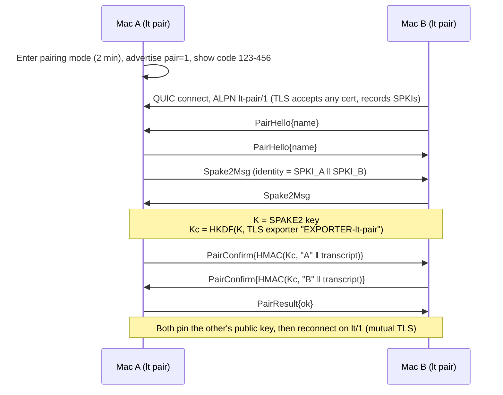
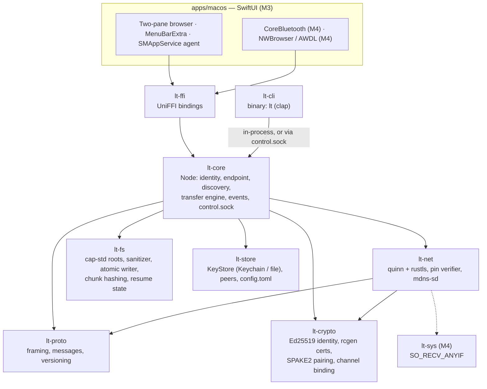
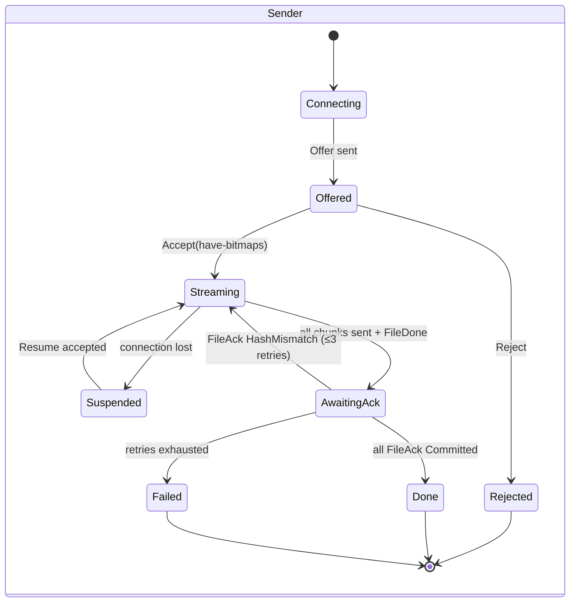
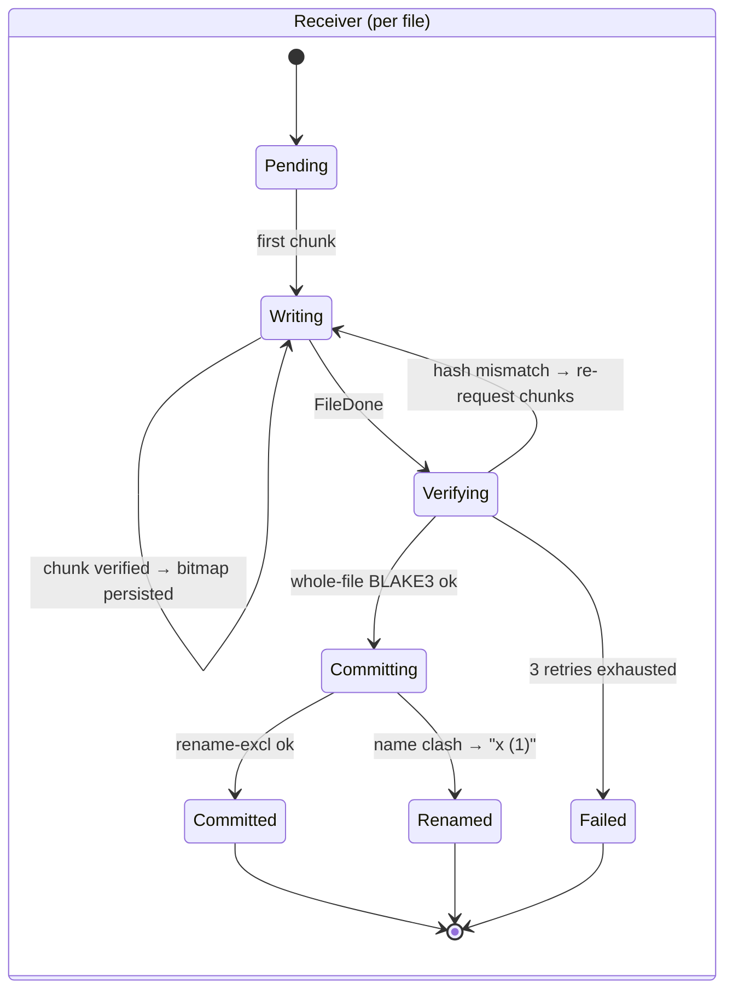

# LocalTransfer Roadmap

LocalTransfer moves files between two Macs (an M4 MacBook Pro and an M2 MacBook Air) in both directions, over the local network, with **no cloud and no accounts**. It has a Rust core, a CLI called `lt`, and a native SwiftUI GUI.

## Milestone status

| Milestone | Branch | Status |
|---|---|---|
| M0: Repo setup, roadmap | `docs/roadmap` | ✅ Done |
| M1: CLI send over LAN with pairing | `feat/m1-cli-send` | ⏳ Not started |
| M2: Remote listing, pull, folders, resume | `feat/m2-ls-get-resume` | ⏳ Not started |
| M3: GUI (SwiftUI + menu bar + agent) | `feat/m3-gui` | ⏳ Not started |
| M4: BLE and novelty features | `feat/m4-*` | ⏳ Not started |

## Contents
1. [Research summary and chosen approach](#1-research-summary-and-chosen-approach)
2. [Transport and discovery](#2-transport-and-discovery)
3. [Security design](#3-security-design)
4. [Novelty features](#4-novelty-features)
5. [Architecture](#5-architecture)
6. [Wire protocol v1](#6-wire-protocol-v1)
7. [Interfaces](#7-interfaces)
8. [Milestones](#8-milestones)
9. [macOS realities](#9-macos-realities)
10. [Test strategy](#10-test-strategy)
11. [Risks and open questions](#11-risks-and-open-questions)
12. [Development workflow](#12-development-workflow)
13. [Sources](#13-sources)

---

## 1. Research summary and chosen approach

| Tool | Discovery | Transport | Security | Strengths / weaknesses |
|---|---|---|---|---|
| **AirDrop** | BLE adverts carrying truncated contact hashes, then AWDL + Bonjour | HTTPS over AWDL (Apple's peer-to-peer 802.11) | Apple ID-backed certs. Contact-hash leakage published by Stute et al. (USENIX Sec '19) | Best-in-class UX. Proprietary and account-bound. AWDL can't be reimplemented without driver-level work. |
| **OpenDrop / OWL** | Same as AirDrop, reverse-engineered | Needs OWL (userland AWDL on a monitor-mode NIC) | Mimics Apple certificate flows | Valuable research. Fragile, Linux-centric, not suitable as a base. |
| **NearDrop** | mDNS for Google Quick Share (Wi-Fi only; BLE not reverse-engineered) | TCP + protobuf (Nearby protocol) | UKEY2 handshake plus a short visual code | Proves a clean-room Swift implementation can work. Receive-only, LAN only. |
| **LocalSend** | UDP multicast `224.0.0.167:53317`, then HTTP `POST /register` | HTTPS REST | Self-signed cert, fingerprint = SHA-256(cert), **trust-on-first-use with no pairing code** | Simple and cross-platform. First contact is MITM-able, and HTTP request/response is clumsy for resume and multiplexing. |
| **croc** | None: rendezvous through a relay (public or self-hosted) | TCP via relay, multiplexed ports | PAKE from a code phrase, end-to-end encrypted | Great pairing UX. Depends on a relay, so it isn't truly local. |
| **magic-wormhole** | Mailbox server plus wordlist code | "Transit": direct TCP or relay, raced in parallel | SPAKE2, then NaCl secretbox | Gold standard for code-based pairing. Needs a server, and every transfer is a one-shot session with no persistent trust. |
| **Syncthing** | LAN broadcast/multicast every 30 s, plus global discovery | TCP/QUIC + TLS (Block Exchange Protocol) | Device ID = hash of cert, mutual TLS, explicit device approval | Excellent pinned-identity model and block hashing. It's continuous folder sync, not ad-hoc "send this file". |
| **KDE Connect** | UDP broadcast on `:1716`, plus mDNS | TCP, upgraded to TLS after a plaintext identity packet | Self-signed certs; the user compares fingerprints at pairing | Dual discovery is a good idea. The plaintext pre-TLS stage has produced real advisories (2020, 2025). |
| **rsync over SSH** | None (you type the host) | SSH | SSH host and user keys | Unbeatable delta transfer. Needs Remote Login enabled, no discovery, no GUI. |

### Decision: borrow ideas from several, design fresh in Rust

None of these is worth porting. AirDrop is closed. LocalSend's TOFU-over-HTTP design falls short of our security bar. Syncthing and rsync solve different problems. What we take from each:

- **Syncthing / KDE Connect:** a device identity that is the hash of a self-generated key, with mutual TLS and key pinning.
- **magic-wormhole / croc:** SPAKE2 short-code pairing, but fully local with no server.
- **LocalSend / KDE Connect:** zero-config LAN discovery. We use Bonjour, the macOS-native mechanism.
- **rsync / Syncthing:** block hashing, which gives us resume and content-addressed skipping.
- **AirDrop:** BLE for presence and AWDL for off-network transfers, done the supported way through Network.framework.

## 2. Transport and discovery

### Data transport: QUIC (`quinn` 0.11 + `rustls` 0.23, ring backend)

Why QUIC rather than TCP+TLS:
- **Multiplexed streams.** One control stream plus N parallel chunk streams, with no head-of-line blocking between files.
- **TLS 1.3 is mandatory** and built into the handshake. There's no plaintext stage, which avoids KDE Connect's class of bugs.
- **Connection migration** survives Wi-Fi address changes.
- **One UDP port** to advertise and allow through the firewall.
- **A pluggable `AsyncUdpSocket`**, which gives a path to bridge AWDL sockets from Network.framework later.

Risk: quinn has no GSO/GRO on macOS, so CPU per byte is higher than with TCP. Wi-Fi (around 100–200 MB/s at best) should still be the bottleneck. **M1 includes a throughput benchmark.** If QUIC underperforms, a `Transport` trait lets TCP+rustls be swapped in without touching the protocol.

### Peer discovery: Bonjour `_localtransfer._udp`

- TXT records: `v=1`, `id=<short device id>`, `name=<friendly name>`, and `pair=1` only while in pairing mode.
- **Rust core:** the `mdns-sd` crate behind a `Discovery` trait. If it conflicts with the system mDNSResponder on port 5353, switch to a dns-sd binding.
- **SwiftUI app:** `NWBrowser`/`NWListener` feed endpoints into the core.
- **Static override:** `--addr host:port`, for tests and for networks that block multicast.

### Bluetooth LE (M4; Swift + CoreBluetooth)

- Used for **presence and pairing assistance only**. Realistic BLE throughput on macOS (L2CAP CoC) is about 50–150 KB/s, far too slow for file payloads.
- Each paired Mac advertises a **rotating token**, `HMAC(pair_secret, 15-minute epoch)`, encoded as a 128-bit service UUID. macOS peripherals can't set manufacturer data, so the token rides in a service UUID. Only paired peers can recognise it.
- A GATT read returns current IP and port hints, so peers can connect directly when mDNS fails.

### Wi-Fi peer-to-peer / AWDL (M4, optional)

AWDL is reachable in two ways:
- **(a) Network.framework** with `NWParameters.includePeerToPeer = true`. This is Apple's supported path and needs Swift, which the GUI already provides.
- **(b) BSD sockets** with the XNU-specific `SO_RECV_ANYIF` socket option, plus Bonjour browsing with `kDNSServiceFlagsIncludeP2P` to bring up `awdl0`.

Plan:
1. Spike (b) first. It is a single `setsockopt` call on quinn's socket, in the isolated `lt-sys` FFI crate, with the P2P Bonjour browse done in Swift.
2. If (b) fails, bridge an `NWConnection` UDP flow into quinn through a custom `AsyncUdpSocket`.

AWDL only works when the app hosts the node, not the standalone CLI.

## 3. Security design

### Identity
- Each device generates an **Ed25519 keypair** on first run.
- **Device ID** = base32(BLAKE3(public key)), truncated to 20 characters and shown grouped: `ABCD-EFGH-IJKL-MNOP-QRST`.
- The secret key is stored in the **macOS login keychain** as a generic-password item (`security-framework` crate). The legacy file-based keychain works for unsigned and self-signed binaries; the data-protection keychain would need entitlements.
- Pinned peers (device ID, public key, alias, permissions) are also stored in Keychain.
- A `KeyStore` trait has two backends: **Keychain** (the default) and **file** (mode 0600, for tests and development only, enabled with `LT_KEYSTORE=file`).

### Transport authentication
- Each device presents a self-signed X.509 certificate built from its Ed25519 key (`rcgen`).
- **Mutual TLS** with custom rustls verifiers on both sides that accept **only pinned SPKIs**. An unknown device fails the handshake before any application data is exchanged.
- ALPN is `lt/1`.

### First-time pairing (ALPN `lt-pair/1`)



- **Channel binding.** Mixing the TLS exporter into the confirmation key means an attacker who terminates TLS on both sides gets different exporter values and fails confirmation.
- **Code policy.** The code has 6 digits and is single-use. **One wrong guess burns the code**, and pairing mode times out after 2 minutes. An online attacker has a 1-in-10⁶ chance per pairing session, and offline attacks aren't possible.
- **QR code** (optional): `lt://pair?code=…&id=…&addr=…`. Mainly useful for a future iPhone client.

### Integrity
- Each chunk carries a BLAKE3 hash, verified on arrival. A bad chunk is re-requested.
- The whole-file BLAKE3 is verified before the file is committed.
- Up to 3 retries, then the file fails. The temp file is kept for resume, and the final file is never written.
- TLS already provides tamper-proof transport. The hashes guard against disk, memory and implementation bugs, and they make resume and dedupe possible.

### Path traversal protection
- Paths travel on the wire as a **list of components** (`["Projects", "x.zip"]`), never as a slash-delimited string.
- Each component is rejected if it is empty, `.`, `..`, contains NUL or `/`, or is longer than 255 bytes. Paths deeper than 64 components are rejected. Names are NFC-normalised.
- All filesystem access goes through **`cap-std` `Dir` handles** opened on the shared root. Absolute paths, `..` and symlink escapes are impossible by construction, not just filtered.
- Remote listing and pull only operate inside **configured shared roots**. The default is `desktop` → `~/Desktop`.

### Atomic writes and no silent overwrite
1. Write to `.<name>.lt-partial-<transfer_id>` in the destination directory (same volume, so the rename is atomic).
2. Flush with `F_FULLFSYNC` (via `rustix`).
3. Verify the whole-file BLAKE3.
4. Rename with **no-replace semantics** (`renameatx_np(RENAME_EXCL)` via `rustix::fs::renameat_with`).
5. On a name clash, use a Finder-style name: `x (1).zip`, `x (2).zip`, and so on.

The clash policy is configurable: `rename` (default) | `prompt` (GUI) | `skip`. Received files get the `com.apple.quarantine` extended attribute, as AirDrop does.

### Peer permissions
Each peer gets these flags, set at pairing and editable later in `~/Library/Application Support/LocalTransfer/config.toml`:
- `allow_browse`: may list my shared roots
- `allow_pull`: may `get` files from my shared roots
- `auto_accept`: incoming sends are accepted without a prompt (a notification is still shown)

### Rust safety and supply chain
- `#![forbid(unsafe_code)]` in every crate except two small, documented FFI crates: `lt-ffi` (UniFFI-generated bindings, M3) and `lt-sys` (`setsockopt` for AWDL, M4). Every `unsafe` block has a `// SAFETY:` comment.
- `cargo clippy --all-targets -- -D warnings -W clippy::pedantic`
- `cargo audit` and `cargo deny check` (advisories, licenses, bans, sources)
- `cargo fuzz` targets for every parser that handles peer input (see §10)

## 4. Novelty features

| # | Idea | Value | Effort | Target |
|---|---|---|---|---|
| 1 | **Verified, resumable chunked transfer.** 4 MiB chunks, each BLAKE3-hashed. The receiver persists a verified-chunk bitmap next to the partial file, so a reconnect resumes exactly where it stopped. | High | Medium | **v1 (M2)** |
| 2 | **Content-addressed skip.** The sender offers chunk hashes up front, cached by path, size, mtime and inode. The receiver checks a local chunk index (destination folder plus recent partials) and asks only for missing chunks. Later, FastCDC so that edited files reuse unchanged regions. | High | Medium–High | M4 |
| 3 | **Drag onto the peer in the menu bar**, plus "Send to Air" in the Finder Share menu and Services. | High | Medium | M3 (menu bar), M4 (Share extension) |
| 4 | **Proximity-gated auto-accept.** When BLE RSSI shows the peer Mac is physically nearby, incoming files are accepted silently. Otherwise the user is prompted. With only two Macs this is used as a security and UX policy, not for choosing a peer. | Medium | Medium–High | M4 |
| 5 | **Transport auto-switch mid-transfer.** LAN → AWDL when Wi-Fi drops. Built on #1, it's a reconnect and resume on another path. | Medium | High | M4 (stretch) |
| 6 | **Drop folder.** Anything placed in `~/Desktop/→ Air` is sent automatically, then moved to `Sent/`. | Medium | Low | M4 |

## 5. Architecture

### Crates and modules



### Repository layout
```
crates/
  lt-proto/    lt-crypto/   lt-store/   lt-fs/
  lt-net/      lt-core/     lt-cli/     lt-ffi/ (M3)   lt-sys/ (M4)
apps/macos/    (M3, Xcode project)
fuzz/          (cargo-fuzz targets + corpus)
.github/workflows/ci.yml
deny.toml  clippy.toml  rust-toolchain.toml
```

### Single-node rule
Only one Node per user listens at a time. A lock file plus `control.sock` in `~/Library/Application Support/LocalTransfer/` enforce this. `lt` commands delegate to a running node (`lt serve` or the app) if there is one. Otherwise they start a short-lived node for that command.

### Transfer state machine





- The receiver decides at the transfer level, by policy: `Offered → Accepted` (auto-accept) or `Offered → Prompt → Accepted | Rejected`.
- A `Cancel` frame moves any state to `Cancelled`. Partials are kept for resume unless the user discards them.
- `Suspended` resumes when `Resume{transfer_id}` matches a persisted partial and bitmap on the receiver.

## 6. Wire protocol v1

### Versioning
- The **major version** is carried in ALPN: `lt/1` for normal sessions and `lt-pair/1` for pairing. A major mismatch fails the TLS handshake with a clear error.
- The **minor version** and **feature bitflags** are exchanged in `Hello`. Behaviour gated on a feature is only used if both sides advertise it.
- Message **tags are append-only** and are never reused or renumbered. A receiver that gets an unknown tag replies `Error{code: Unsupported}` and **keeps the connection open**.

### Framing
```
+----------------+-------------+---------------------------+
| length: u32 BE | tag: u16 BE | body: postcard(Message)   |
+----------------+-------------+---------------------------+
  length = 2 + len(body), and must be ≤ 1 MiB.
  It is checked before any allocation; an oversized frame closes the stream with TooLarge.
```

### Streams
- **Control:** the connecting side opens bidirectional stream 0. The first frame each way must be `Hello` (or `PairHello` on `lt-pair/1`).
- **Data:** the sender opens unidirectional streams, 4 concurrent by default. Each one starts with a `DataHeader` frame followed by exactly `len` raw bytes, and may carry several chunks in sequence.

### Messages (control stream)

| Tag | Message | Fields | Direction |
|---|---|---|---|
| 0x0001 | `Hello` | `proto_minor: u16, features: u64, device_name: String, app_version: String` | both |
| 0x0002 | `Ping` | `nonce: u64` | both |
| 0x0003 | `Pong` | `nonce: u64` | both |
| 0x0004 | `Error` | `req_id: Option<u64>, code: ErrorCode, msg: String` | both |
| 0x0010 | `ListDir` | `req_id: u64, root: String, path: Vec<String>` | requester → owner |
| 0x0011 | `DirListing` | `req_id: u64, entries: Vec<DirEntry{name, kind: File\|Dir\|Symlink, size: u64, mtime: i64}>, more: bool` | owner → requester |
| 0x0012 | `Get` | `req_id: u64, root: String, paths: Vec<Vec<String>>` | requester → owner (owner replies with `Offer`) |
| 0x0020 | `Offer` | `transfer_id: u64, req_id: Option<u64>, root: String, dest: Vec<String>, chunk_size: u32, files: Vec<FileEntry>, more: bool` | sender → receiver |
| 0x0021 | `OfferMore` | `transfer_id: u64, files: Vec<FileEntry>, more: bool` | sender → receiver |
| 0x0022 | `Accept` | `transfer_id: u64, files: Vec<FileAccept{idx: u32, have: Have}>` | receiver → sender |
| 0x0023 | `Reject` | `transfer_id: u64, reason: RejectReason` | receiver → sender |
| 0x0024 | `Resume` | `transfer_id: u64` | sender → receiver (answered with `Accept`) |
| 0x0025 | `FileDone` | `transfer_id: u64, idx: u32, blake3: [u8; 32]` | sender → receiver |
| 0x0026 | `FileAck` | `transfer_id: u64, idx: u32, result: Committed{final_name: String} \| HashMismatch{chunks: Vec<u32>} \| Failed{code}` | receiver → sender |
| 0x0027 | `TransferDone` | `transfer_id: u64` | sender → receiver |
| 0x0028 | `Cancel` | `transfer_id: u64, reason: String` | both |
| 0x0100 | `PairHello` | `device_name: String` | both (`lt-pair/1` only) |
| 0x0101 | `Spake2Msg` | `bytes: Vec<u8>` | both |
| 0x0102 | `PairConfirm` | `mac: [u8; 32]` | both |
| 0x0103 | `PairResult` | `ok: bool, reason: Option<String>` | both |

- `FileEntry = { idx: u32, path: Vec<String>, kind: File|Dir, size: u64, mtime: i64, exec: bool, chunk_hashes: Option<Vec<[u8; 32]>> }`
- `Have = None | All | Bitmap(Vec<u8>)`. `All` means the receiver already has an identical file (M4 dedupe).

### Data stream frame

| Tag | Message | Fields |
|---|---|---|
| 0x0200 | `DataHeader` | `transfer_id: u64, file_idx: u32, chunk_idx: u32, len: u32, blake3: [u8; 32]` |

### Error codes
`Unsupported, NotFound, PermissionDenied, OutsideRoot, InvalidPath, Conflict, HashMismatch, TooLarge, Busy, Internal`

### Limits and timers

| Item | Value |
|---|---|
| Max frame | 1 MiB |
| Chunk size | power of two, 64 KiB to 16 MiB (default 4 MiB) |
| Files per `Offer`/`OfferMore` batch | ≤ 1,000 |
| Path depth / component length | ≤ 64 / ≤ 255 bytes |
| QUIC idle timeout / keepalive | 30 s / 10 s |
| Concurrent data streams | 4 (configurable) |
| Pairing window / attempts | 2 min / 1 |

## 7. Interfaces

### CLI (`lt`)
```
lt pair                              # show a code, or enter the peer's code
lt peers                             # list paired peers and online status
lt unpair <peer>
lt serve                             # run a foreground receiver (M1); the app/agent replaces it in M3
lt send <path>... <peer>[:<dest>]    # default dest: peer's ~/Desktop
lt ls <peer>:~/Desktop[/sub]         # M2
lt get <peer>:~/Desktop/x.zip [dir]  # M2
lt status                            # active and resumable transfers
```
`<peer>` is the alias chosen at pairing time (e.g. `air`, `pro`). `~/Desktop` is an alias for the `desktop` shared root, so nothing outside the shared roots can be addressed.

### Default mapping
`~/Desktop ↔ ~/Desktop`. Configurable in `config.toml` (`[roots] desktop = "~/Desktop"`; more roots can be added).

### GUI choice: SwiftUI shell + Rust core (via UniFFI)

| Option | Native look | Drag-and-drop, Finder feel | BLE / AWDL access | Verdict |
|---|---|---|---|---|
| **SwiftUI + Rust core** | ✅ Native | ✅ `NSItemProvider`, file promises | ✅ CoreBluetooth and Network.framework directly | **Chosen** |
| Tauri | ◐ Web UI | ◐ Workable, not Finder-like | ❌ Still needs Swift/ObjC FFI | — |
| Slint / egui | ❌ Non-native | ❌ Weak external drag-and-drop | ❌ Same FFI problem | — |

The GUI has a two-pane, Finder-style browser (local | remote) with drag-and-drop both ways, a progress bar, pairing UI, a `MenuBarExtra` with drag-onto-peer to send, notifications, and a LaunchAgent registered with `SMAppService` so each Mac is always receivable.

## 8. Milestones

Each milestone has its own branch and merges to `main` only when `cargo fmt`, `cargo clippy` and `cargo test` pass.

### M1: CLI send over LAN with pairing (`feat/m1-cli-send`)
- **Scope:**
  - `rustup update`, Cargo workspace, `rust-toolchain.toml`, CI, `deny.toml`
  - `lt-proto` (framing and messages, plus fuzz targets)
  - `lt-crypto` (identity, certs, SPAKE2, channel binding)
  - `lt-store` (Keychain and file keystores, peers, config)
  - `lt-fs` (sanitizer, cap-std roots, atomic writer, conflict naming)
  - `lt-net` (quinn endpoint, pin verifiers, mdns-sd)
  - `lt-core` (send path)
  - `lt pair | peers | serve | send`
- **Demo:**
  - Pair the two Macs with a 6-digit code.
  - Run `lt serve` on the Air and `lt send report.pdf air` on the Pro. The file appears on the Air's Desktop, hash verified.
  - Repeat in the other direction.
  - A third, unpaired instance is rejected at the TLS handshake.
  - Record the throughput benchmark.

### M2: Remote listing, pull, folders, resume (`feat/m2-ls-get-resume`)
- **Scope:** `lt ls`, `lt get`, recursive folder transfer, control socket delegation, chunk bitmaps, `Resume`, `lt status`.
- **Demo:** turn Wi-Fi off halfway through a 5 GB send, turn it back on, rerun, and the transfer continues from about 50% instead of starting over.

### M3: GUI (`feat/m3-gui`)
- **Scope:**
  - `lt-ffi` (UniFFI) and the SwiftUI app
  - Two-pane browser, drag-and-drop, progress, pairing UI
  - MenuBarExtra with drag-onto-peer
  - Notifications
  - SMAppService agent
  - Info.plist privacy strings
  - A self-signed code-signing identity, and documented notarization steps for later
- **Demo:** drag a file from the local pane to the remote pane, and drop a file onto the Air's icon in the menu bar.

### M4: BLE and novelty (`feat/m4-*`)
- **Scope:** BLE presence and IP hints, proximity-gated auto-accept, content-addressed skip, drop folder, the AWDL spike and implementation, transport auto-switch (stretch), Finder Share extension.
- **Demo:** on a network with client isolation, the Macs still find each other over BLE and transfer over AWDL.

## 9. macOS realities

| Area | What's needed | How it's handled |
|---|---|---|
| **Local Network privacy** | The CLI run from Terminal is exempt, because Terminal is the "responsible" process. The app and agent need `NSLocalNetworkUsageDescription` and `NSBonjourServices = ["_localtransfer._udp"]`. | The prompt appears on the first browse. The agent is registered with `SMAppService` **from inside the app bundle**, so TCC attributes it to the app. |
| **Bluetooth** | `NSBluetoothAlwaysUsageDescription` | App only (M4). |
| **Desktop folder** | A TCC prompt on first access, attributed to Terminal (CLI) or LocalTransfer (app). | Documented, including the reset path: System Settings → Privacy & Security → Files & Folders. |
| **Keychain** | Ad-hoc-signed builds change their cdhash on every rebuild, which brings back the "allow access" prompt. | Sign `lt` and the app with a **self-signed code-signing certificate** created in Keychain Access, which gives a stable designated requirement for free. `LT_KEYSTORE=file` is used in tests and development. |
| **Signing and notarization** | Gatekeeper only blocks downloaded (quarantined) apps. There's no paid Apple Developer account yet. | **Build from source on each Mac** and sign with the self-signed identity. Developer ID signing and notarization are documented for when a membership exists. |
| **Platform** | Apple Silicon only | Target `aarch64-apple-darwin`, deployment target macOS 14. |

## 10. Test strategy

### Unit tests
- Frame and message round-trip. Proptest that decoding arbitrary bytes never panics.
- Path sanitizer: a table of hostile inputs, plus a proptest that a resolved path is always inside the root.
- Conflict naming (`x.zip` → `x (1).zip` → `x (2).zip`, dotfiles, files with no extension).
- Atomic writer: a crash before the rename leaves only `.lt-partial-*`, and an existing target is never clobbered.
- Chunk hashing, and persistence and reload of the resume bitmap.
- SPAKE2: the correct code pairs; a wrong code fails; the code is burned after one failure; a channel-binding mismatch fails.
- Pin verifier: rejects unknown SPKIs and accepts pinned ones.

### Integration tests (`crates/lt-core/tests`, `assert_cmd` for `lt`)
Two Nodes run on `127.0.0.1`, each with a tempdir root, the file keystore and static discovery. Cases:
- pair → send → ls → get, in both directions
- resume after a fault-injecting wrapper cuts the connection at N bytes
- an unknown device is rejected
- a wrong pairing code fails
- a malicious peer sending `..`, absolute or symlink-escaping offers gets `InvalidPath`/`OutsideRoot`, and nothing is written outside the root
- a name clash produces `x (1)`
- a corrupting wrapper triggers re-request and then failure, with no final file written

### Fuzzing (`cargo +nightly fuzz`)
- Targets: `frame_decode`, `message_decode`, `path_sanitize`, `offer_validate`.
- 10 minutes per target before each milestone merge, and 60-second smoke runs in CI. The corpus is committed.

### CI (GitHub Actions, `macos-14` arm64)
`cargo fmt --check` · `cargo clippy --all-targets -- -D warnings -W clippy::pedantic` · `cargo test` · `cargo deny check` · `cargo audit` · fuzz smoke runs

### Manual two-Mac checklist
- [ ] Pair Pro → Air, and Air → Pro (unpair in between)
- [ ] `lt send` a single file, both directions
- [ ] `lt get` a single file, both directions (M2)
- [ ] 10 GB file: throughput recorded, hash matches (`b3sum` on both sides)
- [ ] 10,000 small files in nested folders (M2)
- [ ] Folder containing symlinks: links are not followed outside the root
- [ ] Wi-Fi off mid-transfer → back on → resume (M2)
- [ ] Sender Mac sleeps mid-transfer → wakes → resume (M2)
- [ ] Name clash creates `x (1)`, original untouched
- [ ] An unpaired third instance (separate `LT_HOME`) is rejected
- [ ] Fresh macOS user account: Local Network, Desktop and Keychain prompts appear and work (M3)
- [ ] Received files carry `com.apple.quarantine`
- [ ] App agent receives after logout/login (M3)

## 11. Risks and open questions

### Risks
| Risk | Mitigation |
|---|---|
| quinn throughput on macOS (no GSO/GRO) | M1 benchmark. `Transport` trait allows a TCP+TLS fallback. |
| `mdns-sd` coexisting with mDNSResponder on port 5353 | `Discovery` trait. Swap to a dns-sd binding if needed. |
| AWDL from Rust is unproven | M4 spike with two fallbacks (`SO_RECV_ANYIF`, or an NWConnection bridge). |
| BLE advertising limits on macOS peripherals | Encode the token in a service UUID. Hints go over GATT. |
| Transfers stop when the Mac sleeps or the lid closes | Resume (M2). Optionally hold a power assertion while a transfer is active. |
| Keychain prompts on rebuilds | Self-signed signing identity. File keystore in development. |
| `lt` name clashes with npm `localtunnel` | Document it. A `localtransfer` alias binary if needed. |
| Rust toolchain on this machine is 1.76 (too old) | `rustup update stable` at the start of M1. Pinned in `rust-toolchain.toml`. |

### Open questions
1. Should incoming files from paired peers be **auto-accepted** (with a notification) by default, or prompt every time?
2. Any **shared roots** besides `~/Desktop`, such as `~/Downloads`?
3. Should a paired peer be able to **browse and pull** from your Desktop by default, or should that be opt-in per peer?
4. Is a future **iPhone client** likely? That decides whether QR pairing is worth building early.
5. Are the Macs usually on the **same home network**, or often on networks with client isolation? That decides how early AWDL matters.

## 12. Development workflow

- `main` always builds and passes tests. Work-in-progress is never committed directly to `main`.
- Each milestone or feature gets its own branch: `feat/…`, `fix/…`, `docs/…`, `chore/…`.
- A branch merges only after `cargo fmt`, `cargo clippy` and `cargo test` pass.
- Commits are small and focused, with conventional messages (`feat:`, `fix:`, `docs:`, `chore:`, `test:`, `refactor:`).
- The milestone status table here and in `README.md` is updated whenever a milestone lands.
- Secrets, keys and pairing data are never committed. `.gitignore` covers keystores, `*.pem`, `*.key`, `*.p12` and `.env*`.

## 13. Sources

- LocalSend protocol: https://github.com/localsend/protocol
- AirDrop: https://en.wikipedia.org/wiki/AirDrop
- Stute et al., "A Billion Open Interfaces for Eve and Mallory" (USENIX Security '19): https://www.usenix.net/system/files/sec19-stute.pdf
- NearDrop coverage: https://androidcentral.com/apps-software/nearby-share-macos-unofficial
- croc: https://github.com/schollz/croc
- magic-wormhole: https://pypi.org/project/magic-wormhole/0.7.6
- Syncthing security principles: https://docs.syncthing.net/users/security
- Syncthing device IDs: https://docs.syncthing.net/dev/device-ids
- KDE Connect advisories: https://openwall.com/lists/oss-security/2020/10/13/4 and https://kde.org/info/security/advisory-20250418-2.txt
- `NWParameters.includePeerToPeer`: https://developer.apple.com/documentation/network/nwparameters/includepeertopeer
- NWListener and AWDL interfaces: https://developer.apple.com/forums/thread/718461
- AWDL and `SO_RECV_ANYIF`: https://azuma-hy2.duckdns.org/2019/08/19/awdl.html
- btleplug (central only): https://docs.rs/crate/btleplug/latest
- blew (BLE peripheral on macOS): https://docs.rs/crate/blew/0.1.0
- Local Network privacy for CLI tools and launchd: https://developer.apple.com/forums/thread/767391
